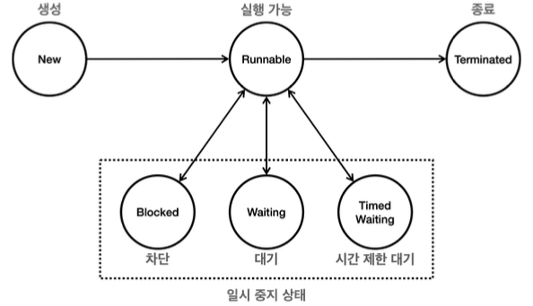
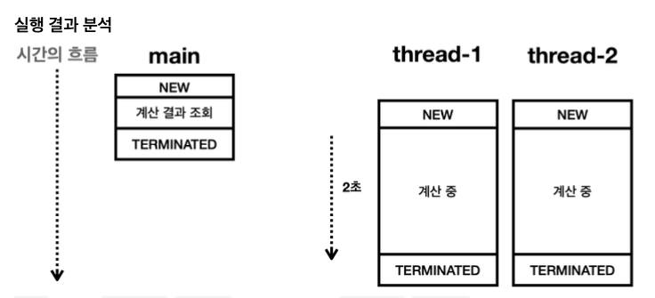
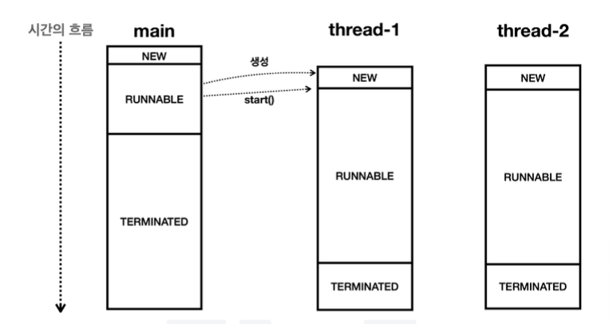

# 스레드 제어와 생명 주기1

## 스레드 기본 정보
main thread 정보를 출력해보자
```
17:40:30.131 [     main] main thread: Thread[#1,main,5,main]
17:40:30.135 [     main] main thread id: 1
17:40:30.135 [     main] main thread name: main
17:40:30.137 [     main] main thread priority: 5
17:40:30.137 [     main] main thread group: java.lang.ThreadGroup[name=main,maxpri=10]
17:40:30.137 [     main] main thread state: RUNNABLE
```
- `Thread.currentThread()`: 현재 실행 중인 스레드 반환
- `Thread#getId()`: 스레드 고유 id 반환, 스레드가 생성될 때 할당되며 우리가 직접 지정할 수 없음
- `Thread#getName()`: 스레드 이름 반환, 이름은 중복 가능
- `Thread#getPriority()`: 스레드 우선 순위 반환
  - 1 ~ 10, 기본값 5
  - 우선순위가 높을수록 실행 기회가 더 많음, 반드시 실행 순서와 동일하지는 않음
  - 실제로 조정할 일은 거의 없음
- `Thread#getThreadGroup()`: 스레드 그룹 반환
  - 기본적으로 모든 스레드는 부모 스레드와 동일한 스레드 그룹에 속한다
  - 부모 스레드: 새로운 스레드를 생성하는 스레드, 기본적으로 스레드는 다른 스레드에 의해 생성된다
- `Thread#getState()`: 스레드 상태 반환
  - `NEW`: 스레드 생성, 아직 start() 호출하지 않음
  - `RUNNABLE`: 실행 중 또는 실행 가능
  - `BLOCKED`: 동기화 블록에 의해 대기 중
  - `WAITING`: 다른 스레드가 통지할 때까지 무한히 대기 중
  - `TIMED_WAITING`: 일정 시간 동안 대기 중
  - `TERMINATED`: 실행 종료
 
## 스레드의 생명 주기
생성 -> 실행 가능 -> 종료


1. New (새로운 상태)
- 스레드가 생성되고 아직 시작은 안 된 상태
- start() 메서드가 호출되지 않은 상태

2. Runnable (실행 가능 상태)
- 실행될 준비가 된 상태
- start() 메서드가 호출된 상태
- 그러나 Runnable 상태라고 모두 동시에 실행되는 건 아님
  - 운영체제의 스케줄러가 결정
  - 자바에서 실행 대기열인지, 실행 중인지 확인할 수 없음
- 보통 실행 상태라고 부른다

3. Blocked(차단 상태)
- 스레드가 다른 스레드에 의해 동기화 락을 얻기 위해 기다리는 상태
- synchronized 블록에 진입하기 위해 락을 얻어야 하는 경우

4. Waiting(대기 상태)
- 다른 스레드가 통지할 때까지 기다리는 상태
- Object.wait(), Thread.join() 메서드 호출로 인해 대기 상태가 됨
- notify() 또는 notifyAll() 메서드로 통지를 받아 Runnable 상태로 전이

5. Timed Waiting(제한 시간 동안 대기 상태)
- 일정 시간이 지나면 자동으로 Runnable 상태로 전이
- Thread.sleep(), Object.wait(long timeout), Thread.join(long millis), LockSupport.parkNanos() 등

6. Terminated(종료 상태)
- 스레드가 실행을 마친 상태
- run() 메서드가 종료되거나, stop() 메서드로 강제 종료된 상태
- 종료된 스레드는 다시 시작할 수 없음



## 체크 예외 재정의
InterruptedException을 던지는 메서드를 사용할 때는 반드시 예외를 처리해야 한다
```java
package thread.control;

public class CheckedExceptionMain {
    public static void main(String[] args) throws Exception {
        throw new Exception();
    }
    
    static class MyRunnable implements Runnable {
        @Override
        public void run() /*throws Exception*/ {
//            throw new Exception();
        }
    }
}
```
- `main()` 메서드에서 예외를 던지면, 예외를 처리하지 않아도 된다
- `run()` 메서드에서 예외를 던지면, 예외를 처리해야 한다
  - `run()` 메서드는 `Runnable` 인터페이스의 추상 메서드이므로, 예외를 던질 수 없다

**재정의 메서드가 지켜야 할 예외 관련 규칙**
- 체크 예외
  - 부모 메서드가 체크 예외를 던지지 않는다면, 자식 메서드도 던질 수 없다
  - 자식 메서드는 부모 메서드가 던지는 예외의 하위 예외만 던질 수 있다
- 런타임 예외
  - 부모 메서드가 런타임 예외를 던지든 안 던지든 자식 메서드는 런타임 예외를 던질 수 있다

왜?
- 자바 컴파일러는 부모 메서드의 예외를 던지는지 확인하고, 자식 메서드가 던지는 예외가 부모 메서드의 예외와 호환되는지 확인한다
- 자식 메서드에서 부모 메서드에 정의되지 않은 예외를 던지면, 부모 메서드에서 예외를 처리할 수 없다
- 따라서 자식 메서드에서 던지는 예외는 부모 메서드에서 처리할 수 있는 예외의 하위 예외이어야 한다

왜 run() 메서드는 예외를 던질 수 없게 설계했을까?
- 스레드가 예외를 던지면, 스레드가 종료되고, 예외를 던진 스레드를 잡을 수 없다
- 최근에는 체크 예외보다는 런타임 예외를 던지는 것이 더 좋은 방법이다


### Sleep 유틸리티
매번 `Thread.sleep()`을 호출할 때마다 `InterruptedException`을 처리하는 것은 번거롭다


## join - 시작
Waiting: 다른 스레드가 통지할 때까지 기다리는 상태



두 스레드를 시작한 다음에 바로 결과를 조회 -> 스레드의 작업이 끝날 때까지 기다리지 않음

**참고: this의 비밀**
인스턴스의 메서드를 호출하면, 어떤 인스턴스의 메서드를 호출했는지 기억하기 위해 this를 사용한다
해당 인스턴스의 참조값을 스택 프레임 내부에 저장한다

## join - sleep 사용
sleep을 사용하면 스레드가 일정 시간 동안 대기하고, 그 시간이 지나면 자동으로 Runnable 상태로 전이된다
원하는 결과를 얻을 수는 있지만, 정확한 시간을 지정하기 어렵다
언제 끝나는지 알 수 없다
다른 방법?
- while(true)로 무한 루프를 돌면서, 다른 스레드가 종료될 때까지 기다릴 수 있다
- CPU를 계속 사용하게 되어 비효율적이다

## join - join 사용

```java
        // 스레드가 종료될 때까지 대기
        log("main 스레드 종료 대기");
        thread1.join();
        thread2.join();
        log("main 스레드 종료 대기 끝");
```
- `join()`: 대상 스레드가 TREMINATED 상태가 될 때까지 대기

단점: 다른 스레드가 완료될 때까지 무기한 기다린다

일정 시간만 기다리고 싶다면?


